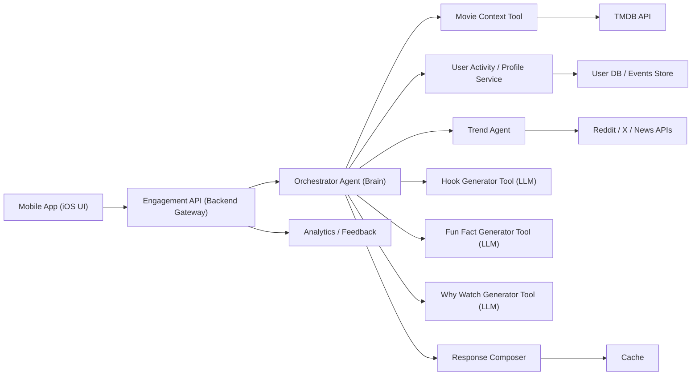

# Engagement Agent Solution Design v1.0.0

## Document Status

- Product: `Engagement Agent`
- Version: `v1.0.0`
- Status: `Draft`
- Owner: `Engineering / AI Platform`
- Related Product Spec: `docs/product-specs/engagement-agent-product-spec-v1.0.0.md`

## Overview

This document defines the technical solution for `Engagement Agent v1.0.0`, based on the product spec. The goal is to deliver a lightweight backend-driven AI experience that generates three short engagement snippets on a movie detail page:

- `Fun Fact`
- `Hook`
- `Why Watch This Now`

The design favors:

- narrow agent responsibilities
- simple orchestration boundaries
- structured LLM outputs
- safe fallback behavior
- low-latency mobile delivery
- minimal architecture for MVP

## Goals

- Serve three engagement snippets for a movie detail page request
- Personalize `Why Watch This Now` when user context is available
- Support optional fun-fact enrichment from approved web and social sources
- Prevent unsupported or fabricated factual claims
- Keep the system observable, cacheable, and easy to iterate

## Non-Goals

- full chat assistant
- MCP server
- open-ended autonomous agent collaboration
- advanced recommendation ranking
- long-term conversational memory
- live second-screen companion features

## System Context

The mobile app already uses `TMDB` as the primary movie data source. This solution adds a bounded `agentic engagement layer` that combines:

- TMDB movie metadata
- internal user activity summaries
- optional external enrichment summaries
- specialist agents with explicit responsibilities
- LLM generation with strict output structure

For `v1.0.0`, the system should be agentic in architecture but not overly autonomous. It should use a single orchestrator with a small set of deterministic specialist agents instead of a free-form multi-agent swarm.

## High-Level Architecture



## Primary Request Flow

1. The user opens a movie page in the `Mobile App (iOS UI)`.
2. The app calls the `Engagement API (Backend Gateway)` with `tmdbId` and `userId`.
3. The backend gateway forwards the request to the `Orchestrator Agent (Brain)`.
4. The orchestrator calls `Movie Context Tool`, which retrieves normalized movie metadata from `TMDB API`.
5. The orchestrator calls `User Activity / Profile Service`, which retrieves user taste signals from the `User DB / Events Store`.
6. The orchestrator optionally invokes `Trend Agent`, which gathers external momentum or buzz signals from `Reddit / X / News APIs`.
7. The orchestrator sends the right context to three specialized generation tools:
8. `Hook Generator Tool (LLM)` generates the hook.
9. `Fun Fact Generator Tool (LLM)` generates the fun fact.
10. `Why Watch Generator Tool (LLM)` generates the personalized or fallback watch reason.
11. The orchestrator sends all outputs to the `Response Composer`.
12. The response composer validates, assembles, and stores the final response in `Cache`.
13. The `Engagement API (Backend Gateway)` returns the composed response to the mobile client.
14. Request, feedback, and downstream engagement events are sent to `Analytics / Feedback`.

## Agent Design

### 1. Orchestrator Agent

Responsibilities:

- receive movie-page engagement requests
- coordinate tool and agent execution
- manage shared request state
- decide whether trend enrichment is needed
- combine final inputs for generation
- send outputs to the response composer after generation

Design rules:

- orchestration should stay narrow and deterministic
- trend enrichment should remain optional
- all outputs should flow through the response composer for final validation
- orchestration may run sequentially first, with later parallelization where safe

### 2. Movie Context Tool

Responsibilities:

- retrieve movie details and credits through TMDB-backed adapters
- normalize movie metadata for downstream generation
- provide a compact context object for the orchestrator

Suggested functions:

- `get_movie_details(tmdb_id)`
- `get_movie_credits(tmdb_id)`
- `build_movie_context(tmdb_id)`

### 3. User Activity / Profile Service

Responsibilities:

- retrieve user activity signals
- transform raw user activity into a compact model-friendly summary
- assign personalization confidence tier
- avoid leaking raw activity data to the LLM

Suggested output:

```json
{
  "topGenres": ["Sci-Fi", "Thriller"],
  "favoriteActors": ["Zendaya"],
  "recentThemes": ["space", "mystery"],
  "preferredPacing": "slow-burn",
  "personalizationConfidence": "medium"
}
```

### 4. Trend Agent

Responsibilities:

- decide what external trend signals are relevant for the current movie
- gather social or news context from approved sources
- convert noisy trend signals into compact, safe trend summaries
- return trend insights to the orchestrator

Design rules:

- trend inputs are optional enrichment, not required inputs
- social posts are audience-interest or momentum signals unless independently supported
- news coverage may be used for cultural relevance, release momentum, or discussion spikes
- unsupported or conflicting claims are dropped

### 5. Hook Generator Tool (LLM)

Responsibilities:

- generate a concise curiosity-driven hook
- use movie context and optional trend context
- avoid spoilers and repetitive generic phrasing

### 6. Fun Fact Generator Tool (LLM)

Responsibilities:

- generate a safe `Fun Fact`
- use movie context as the default input
- optionally use trend context when source quality is acceptable
- avoid unsupported specific claims

### 7. Why Watch Generator Tool (LLM)

Responsibilities:

- generate a personalized or fallback watch reason
- combine movie context with user profile signals
- degrade gracefully when personalization confidence is low

### 8. Response Composer

Responsibilities:

- combine generator outputs into the final response payload
- validate structure, safety, and fallback rules
- set metadata such as `personalized`, `trendUsed`, and `fallbackUsed`
- prepare the payload for caching and API return

### 9. Trend Source Layer

Responsibilities:

- provide approved external content for the trend agent
- expose only allowlisted source content
- support extraction of short source summaries or signals

Suggested output:

```json
{
  "enabled": true,
  "items": [
    {
      "type": "publisher",
      "summary": "Interview coverage emphasizes the film's large-scale world-building ambitions.",
      "confidence": "high"
    },
    {
      "type": "social_trend",
      "summary": "Audience discussion frequently highlights the cast chemistry and visual scale.",
      "confidence": "medium"
    }
  ]
}
```

## Data Contracts

### Request Contract

```json
{
  "tmdbId": 550,
  "userId": "user_123"
}
```

### Prompt Input Contract

```json
{
  "movie": {
    "title": "Example Title",
    "overview": "Short normalized summary",
    "genres": ["Sci-Fi", "Drama"],
    "releaseYear": 2024,
    "director": "Director Name",
    "topCast": ["Actor A", "Actor B"],
    "popularityBand": "high"
  },
  "userSummary": {
    "topGenres": ["Sci-Fi"],
    "favoriteActors": ["Actor A"],
    "recentThemes": ["space"],
    "preferredPacing": "slow-burn",
    "personalizationConfidence": "medium"
  },
  "trendSummary": {
    "enabled": true,
    "items": [
      {
        "type": "trend_signal",
        "summary": "Recent coverage and audience discussion emphasize the movie's visual scale and cast momentum.",
        "confidence": "high"
      }
    ]
  }
}
```

### Response Contract

```json
{
  "movieId": 550,
  "engagement": {
    "funFact": "This film stands out for pairing large-scale spectacle with strong character focus.",
    "hook": "A visually ambitious story that balances scale with emotional tension.",
    "whyWatchNow": "You have been leaning into cerebral sci-fi lately, and this fits that mood."
  },
  "metadata": {
    "personalized": true,
    "fallbackUsed": false,
    "trendUsed": true,
    "version": "v1.0.0"
  }
}
```

## Shared State Design

The orchestrator should manage a narrow shared state object:

```json
{
  "movie": {},
  "userSummary": {},
  "trendSummary": {},
  "hook": "",
  "funFact": "",
  "whyWatchNow": "",
  "composedResponse": {},
  "validation": {
    "fallbackUsed": false
  }
}
```

This keeps the agent flow observable and aligns with a graph-based execution model.

## Prompt Design

### Prompting Principles

- keep prompts concise and structured
- provide only normalized inputs
- ask for valid JSON only
- avoid inviting speculative trivia
- prioritize safe, broad claims over risky specifics

### System Prompt Shape

```text
You generate spoiler-safe engagement copy for a movie mobile app.

Return valid JSON with:
- funFact
- hook
- whyWatchNow

Rules:
- Keep each field short and mobile-friendly.
- Avoid spoilers.
- Do not invent unsupported specific claims.
- Use trend context only when the source summary is credible.
- Use user context only when provided and avoid overly specific behavior references.
```

## Fallback Strategy

Fallback priority:

1. cached generic movie engagement
2. template-driven generation from TMDB metadata only
3. static safe generic copy

Example fallback:

```json
{
  "funFact": "A widely discussed title known for its strong style and audience appeal.",
  "hook": "A polished pick with a memorable tone.",
  "whyWatchNow": "A strong choice if you want something engaging tonight."
}
```

## Personalization Strategy

The LLM should receive compact summaries, not raw event logs.

Rules:

- personalize only `whyWatchNow` by default
- mention at most one or two preference signals
- degrade to generic copy when confidence is low
- do not expose hidden user tracking details

## Trend Context Strategy

Trend context should be optional and additive.

Rules:

- use trend context mainly for `funFact` and `hook`
- do not require trend context to produce an answer
- avoid turning short-lived hype into hard factual claims
- prefer concise trend framing such as buzz, momentum, or discussion themes

## Trend Enrichment Pipeline Design

For `v1.0.0`, trend enrichment should be built as a bounded optional service, not a hard dependency.

Pipeline:

1. fetch candidate sources from allowlisted targets
2. extract page or post text
3. summarize into short evidence snippets
4. classify source type and confidence
5. return condensed trend context to the orchestrator

Recommended source categories:

- studio and distributor pages
- official movie sites
- official YouTube interviews
- reputable entertainment publishers
- film festival pages and official Q&A summaries
- approved public social platforms as trend signals

Disallowed categories:

- low-quality anonymous blogs
- rumor-only aggregators
- unattributed repost sites
- private or deleted social content

## Response Composition, Validation, and Caching Strategy

Validation should happen inside the `Response Composer` after generation and before response return.

Checks:

- all required fields present
- all fields are strings
- length within product-defined limits
- no spoiler phrases from blocked-pattern list
- no unsupported hard factual claims when source confidence is low
- no empty or duplicate outputs

If validation fails:

- retry once with a stricter repair prompt, or
- return template fallback content

Caching is required to control cost and latency.

Recommended cache keys:

- `movieId + version` for generic content
- `movieId + userSegment + trendSegment + version` for trend-aware personalization

Recommended behavior:

- pre-generate popular movie generic content
- cache generic outputs longer than personalized outputs
- cache trend-aware outputs more briefly than generic outputs
- invalidate when prompt version or source policy changes

## Observability

Track:

- request latency
- movie context fetch latency
- user profile fetch latency
- trend enrichment latency
- hook generation latency
- fun fact generation latency
- why watch generation latency
- response composition latency
- cache hit rate
- validation failure rate
- fallback rate
- trend enrichment usage rate
- feedback events
- downstream conversion events

## Error Handling

Failure scenarios:

- TMDB unavailable
- user profile service unavailable
- trend source unavailable
- trend agent failure
- LLM timeout
- invalid LLM output

Handling rules:

- movie context failure returns endpoint failure or upstream movie-detail fallback
- user profile service failure should produce generic `whyWatchNow`
- trend source failure should not fail the request
- trend agent failure should drop trend context and continue
- LLM failure should trigger fallback generation

## Security and Safety

- do not store raw scraped copyrighted long-form text in prompt history longer than needed
- keep only compact extracted summaries where possible
- do not treat social buzz as verified production truth
- enforce source allowlists for scraping
- apply content moderation and blocked-pattern checks before serving output

## API Evolution Notes

Version `v1.0.0` should keep a narrow contract focused on snippets. Future versions may add:

- source attribution metadata
- explanation tags such as `cast`, `acclaim`, or `trend`
- locale-aware generation
- richer user taste segmentation
- more explicit trend freshness metadata

## Rollout Plan

### Phase 1

TMDB-only generic engagement generation.

### Phase 2

Add user taste summaries and personalized `whyWatchNow`.

### Phase 3

Add `Trend Agent`, approved social and news sourcing, and trend reasoning with source trust controls.

## Open Implementation Choices

The product spec does not force exact technology choices, but this repository’s defaults suggest:

- `FastAPI` for the HTTP API
- modular Python services
- structured OpenAI integration
- PostgreSQL-backed storage for analytics or cached metadata if persistence is needed

These should be adopted only as implementation begins.

## Summary

`Engagement Agent v1.0.0` should be implemented as a bounded agentic workflow centered on an `Orchestrator Agent (Brain)`. The orchestrator should use `Movie Context Tool`, `User Activity / Profile Service`, an optional `Trend Agent`, specialized LLM generator tools, and a `Response Composer` to produce the final engagement payload. This keeps the MVP practical to ship while making the top-level design clearly agentic and extensible.
