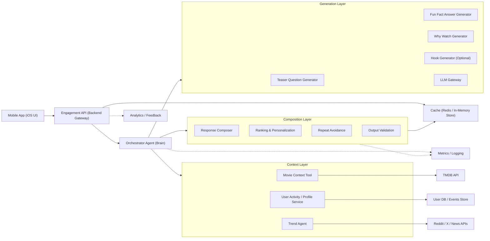
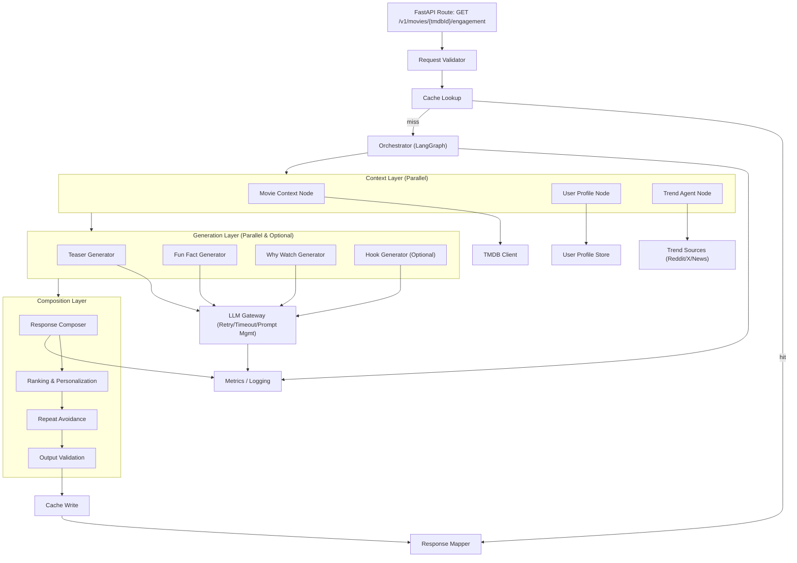
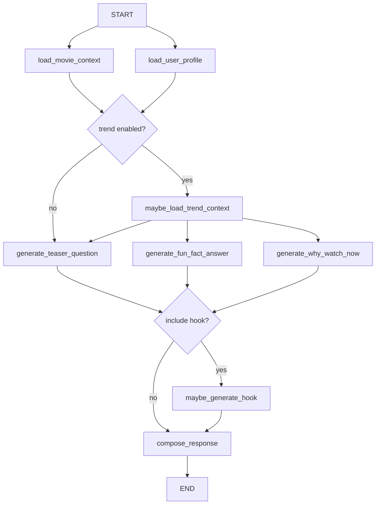

# Engagement Agent Solution Design v1.0.0

## Document Status

- Product: `Engagement Agent`
- Version: `v1.0.0`
- Status: `Draft`
- Owner: `Engineering / AI Platform`
- Related Product Spec: `docs/product-specs/engagement-agent-product-spec-v1.0.0.md`

## Overview

This document defines the technical solution for `Engagement Agent v1.0.0`, based on the product spec. The goal is to deliver a lightweight backend-driven AI experience that generates a curiosity-first engagement experience on a movie detail page:

- `Teaser Question`
- `Fun Fact Answer`
- `Why Watch This Now`

An optional `Hook` may also be generated when the UI supports it.

The design favors:

- narrow agent responsibilities
- simple orchestration boundaries
- structured LLM outputs
- safe fallback behavior
- low-latency mobile delivery
- minimal architecture for MVP

## Goals

- Serve teaser-question reveal content for a movie detail page request
- Personalize `Why Watch This Now` when user context is available
- Support optional fun-fact enrichment from approved web and social sources
- Avoid repeating the same revealed fun-fact answer for the same user when reasonable alternatives exist
- Prevent unsupported or fabricated factual claims
- Keep the system observable, cacheable, and easy to iterate

## Non-Goals

- full chat assistant
- MCP server
- open-ended autonomous agent collaboration
- advanced recommendation ranking
- long-term conversational memory
- live second-screen companion features

## System Context

The mobile app already uses `TMDB` as the primary movie data source. This solution adds a bounded `agentic engagement layer` that combines:

- TMDB movie metadata
- internal user activity summaries
- optional external enrichment summaries
- specialist agents with explicit responsibilities
- LLM generation with strict output structure

For `v1.0.0`, the system should be agentic in architecture but not overly autonomous. It should use a single orchestrator with a small set of deterministic specialist agents instead of a free-form multi-agent swarm.

## Recommended Platform

### Agentic Platform

Recommended platform for `v1.0.0`:

- `Python`
- `FastAPI` for the backend API layer
- `LangGraph` for orchestrator and agent workflow control
- `OpenAI API` for LLM-powered generation tools

Why this platform is recommended:

- `LangGraph` fits the bounded agentic workflow well because it supports explicit state, deterministic transitions, and narrow node responsibilities
- `FastAPI` matches the repository backend defaults and is a strong fit for mobile-facing JSON APIs
- `Python` keeps integration simple across orchestration, prompt handling, caching, and enrichment pipelines
- `OpenAI API` works well for structured generation of teaser questions, reveal answers, and watch-intent copy

### Why Not MCP for v1.0.0

`MCP` is not recommended for the first implementation because:

- there is one main app integration path
- the tools are internal backend components, not broadly shared external tools yet
- the MVP needs tight latency control and straightforward backend orchestration

MCP can be reconsidered later if the system expands into:

- multiple user-facing assistants
- internal editorial AI tooling
- reusable cross-agent tool ecosystems

## Recommended Architecture Style

The recommended architecture style for `v1.0.0` is:

- `agentic orchestration layer`
- `modular backend services`
- `tool-based execution`
- `LLM generation at the edges of orchestration`

In practice, that means:

- `Engagement API` is the backend gateway
- the gateway performs request validation, cache lookup, and response mapping
- `Orchestrator Agent` manages workflow state and routing
- the `Context Layer` provides movie, user, and trend context
- the `Generation Layer` calls the LLM through a shared gateway
- the `Composition Layer` assembles, ranks, deduplicates, validates, and caches the final payload

This is not a microservice-heavy design for v1.0.0. It is better implemented as a modular backend with clear internal boundaries rather than many independently deployed services.

## High-Level Architecture

This high-level architecture is based on the reference diagram provided for the solution design and is intended to show the major system building blocks only. It should be read as a conceptual system map, not as an execution flow.



Reference-image alignment:

- `Mobile App (iOS UI)` opens the movie page and requests engagement content
- `Engagement API (Backend Gateway)` is the only mobile-facing integration point
- `Orchestrator Agent (Brain)` plans tool usage and coordinates response generation
- `Context Layer` groups `Movie Context Tool`, `User Activity / Profile Service`, and `Trend Agent`
- `Generation Layer` groups the teaser, fun-fact-answer, why-watch, and optional hook generators behind the `LLM Gateway`
- `Composition Layer` groups `Response Composer`, `Ranking & Personalization`, `Repeat Avoidance`, and `Output Validation`
- `Cache (Redis / In-Memory Store)` stores recent responses for latency reduction
- `Metrics / Logging` captures orchestration, generation, and composition observability
- `Analytics / Feedback` collects events, ratings, and usage signals

## Low-Level Architecture

The low-level view below translates the reference image into concrete backend execution units that engineering can implement. It should be read as a runtime and processing flow.



## Implementation Architecture

Suggested backend module layout:

```text
app/
  api/
    routes/
      engagement.py
    schemas/
      engagement.py
  agents/
    orchestrator.py
    state.py
    nodes/
      movie_context.py
      user_profile.py
      trend_agent.py
      teaser_question.py
      fun_fact_answer.py
      why_watch.py
      hook.py
      response_composer.py
  services/
    tmdb/
      client.py
      mapper.py
    user_profile/
      service.py
    trends/
      service.py
      sources/
        reddit.py
        x.py
        news.py
  llm/
    gateway.py
    prompts/
      teaser_question.txt
      fun_fact_answer.txt
      why_watch.txt
      hook.txt
    client.py
    schemas.py
  cache/
    service.py
  analytics/
    events.py
    metrics.py
  storage/
    repositories/
      reveal_history.py
      feedback.py
  composition/
    ranking.py
    repeat_avoidance.py
    validation.py
```

Suggested runtime boundaries:

- `API layer`: FastAPI request handling, auth, schema validation, cache lookup, response mapping
- `orchestration layer`: LangGraph state graph and agent routing
- `context layer`: TMDB, user profile, trend retrieval, reveal-history lookup
- `generation layer`: shared LLM gateway, prompt execution, structured parsing
- `composition layer`: response assembly, ranking, repeat avoidance, validation, cache write
- `observability layer`: metrics, logs, and usage events

## Execution Layers

The implementation should follow the same layered structure used in the diagrams:

1. `Gateway layer`
   Handles request validation, cache lookup, response mapping, and mobile-safe response return.
2. `Context layer`
   Loads normalized movie context, user context, and optional trend context.
3. `Generation layer`
   Produces teaser question, fun-fact answer, why-watch copy, and optional hook through the shared LLM gateway.
4. `Composition layer`
   Combines outputs, applies ranking and personalization, avoids repeats, validates safety, and writes cache.
5. `Observability layer`
   Records orchestration, generation, composition, reveal, and feedback metrics.

## Mobile App Interaction Design

The mobile app should not interact with the agents directly. It should only interact with the backend gateway API.

Recommended mobile interaction pattern:

1. iOS movie detail page loads basic movie content as usual.
2. The app calls the engagement endpoint in parallel with other detail-page requests.
3. The app renders:
   - `teaserQuestion` immediately
   - hidden `funFactAnswer` behind tap-to-reveal
   - visible `whyWatchNow`
   - optional `hook` if present
4. When the user taps reveal, the app expands the answer and emits a reveal event.
5. When the user gives feedback, the app emits helpful or not-helpful events.

Recommended mobile behavior:

- render cached or skeleton state while loading
- treat engagement as an enhancement, not a blocking dependency for the page
- support stale-safe rendering if the engagement request fails
- send reveal events only when the answer is actually opened

## API Design

### Endpoint

```text
GET /v1/movies/{tmdbId}/engagement
```

### Query Parameters

- `userId`: required for personalized and repeat-aware behavior
- `includeHook`: optional boolean
- `clientPlatform`: optional string such as `ios`
- `locale`: optional locale code for future localization

Example:

```text
GET /v1/movies/550/engagement?userId=user_123&includeHook=true&clientPlatform=ios
```

### Response Shape

```json
{
  "movieId": 550,
  "engagement": {
    "teaserQuestion": "Do you know why this film became such a big cultural talking point?",
    "funFactAnswer": "It stood out for combining large-scale spectacle with a story that audiences kept discussing long after watching.",
    "whyWatchNow": "You have been leaning into cerebral sci-fi lately, and this fits that mood.",
    "hook": "A visually ambitious watch with strong discussion energy."
  },
  "metadata": {
    "personalized": true,
    "trendUsed": true,
    "fallbackUsed": false,
    "hookIncluded": true,
    "factId": "fact_021",
    "version": "v1.0.0"
  }
}
```

### Feedback and Reveal APIs

Recommended follow-up endpoints:

```text
POST /v1/movies/{tmdbId}/engagement/reveal
POST /v1/movies/{tmdbId}/engagement/feedback
```

Suggested reveal event body:

```json
{
  "userId": "user_123",
  "factId": "fact_021",
  "revealedAt": "2026-05-01T10:30:00Z"
}
```

Suggested feedback body:

```json
{
  "userId": "user_123",
  "factId": "fact_021",
  "feedback": "helpful"
}
```

### API Behavior Rules

- `GET /engagement` should be safe to call repeatedly
- reveal history should only be updated by the reveal endpoint, not by the initial fetch
- feedback should be asynchronous and not block UI rendering
- if `userId` is unavailable, the API should still return generic non-personalized engagement

## Agent Workflow Design

Recommended `LangGraph` node order for `v1.0.0`:

1. `load_movie_context`
2. `load_user_profile`
3. `maybe_load_trend_context`
4. `generate_teaser_question`
5. `generate_fun_fact_answer`
6. `generate_why_watch_now`
7. `maybe_generate_hook`
8. `compose_response`

### LangGraph Diagram



This graph represents the orchestration logic inside `LangGraph`, not the full HTTP request lifecycle. Cache lookup, request validation, response mapping, and analytics remain outside the graph in the API and platform layers.

Suggested execution notes:

- cache hit returns from the gateway without entering the graph
- `load_movie_context` and `load_user_profile` can run in parallel
- `maybe_load_trend_context` can run only if enabled by feature flag or movie popularity rules
- generator nodes can run in parallel once shared inputs are available
- `compose_response` should remain the single exit path inside the graph
- ranking, repeat avoidance, and validation should be treated as composition sub-steps

## Primary Request Flow

1. The user opens a movie page in the `Mobile App (iOS UI)`.
2. The app calls the `Engagement API (Backend Gateway)` with `tmdbId` and `userId`.
3. The gateway validates the request and checks cache.
4. If a valid cached response exists, the gateway maps and returns it immediately.
5. If cache misses, the gateway forwards the request to the `Orchestrator Agent (Brain)`.
6. The orchestrator calls `Movie Context Tool`, which retrieves normalized movie metadata from `TMDB API`.
7. The orchestrator calls `User Activity / Profile Service`, which retrieves user taste signals and reveal history from the `User DB / Events Store`.
8. The orchestrator optionally invokes `Trend Agent`, which gathers external momentum or buzz signals from `Reddit / X / News APIs`.
9. The orchestrator sends the prepared context into the `Generation Layer`.
10. `Teaser Question Generator Tool (LLM)`, `Fun Fact Answer Generator Tool (LLM)`, and `Why Watch Generator Tool (LLM)` generate their outputs through the shared `LLM Gateway`.
11. The orchestrator may also request an optional hook when the client experience supports it.
12. The `Composition Layer` assembles the outputs in `Response Composer`.
13. `Ranking & Personalization` orders or adjusts the response for the current user.
14. `Repeat Avoidance` filters already-seen answer variants when alternatives are available.
15. `Output Validation` applies structure and safety checks.
16. The composed response is written to `Cache`, mapped to the API response shape, and returned to the mobile client.
17. Orchestration, generation, reveal-click, feedback, and downstream engagement events are sent to `Metrics / Logging` and `Analytics / Feedback`.

## Agent Design

### 1. Orchestrator Agent

Responsibilities:

- receive movie-page engagement requests
- coordinate tool and agent execution
- manage shared request state
- decide whether trend enrichment is needed
- combine final inputs for generation
- send outputs to the response composer after generation

Design rules:

- orchestration should stay narrow and deterministic
- trend enrichment should remain optional
- all outputs should flow through the response composer for final validation
- orchestration may run sequentially first, with later parallelization where safe

### 2. Movie Context Tool

Responsibilities:

- retrieve movie details and credits through TMDB-backed adapters
- normalize movie metadata for downstream generation
- provide a compact context object for the orchestrator

Suggested functions:

- `get_movie_details(tmdb_id)`
- `get_movie_credits(tmdb_id)`
- `build_movie_context(tmdb_id)`

### 3. User Activity / Profile Service

Responsibilities:

- retrieve user activity signals
- transform raw user activity into a compact model-friendly summary
- assign personalization confidence tier
- avoid leaking raw activity data to the LLM
- return previously revealed teaser-question and fun-fact-answer history when available

Suggested output:

```json
{
  "topGenres": ["Sci-Fi", "Thriller"],
  "favoriteActors": ["Zendaya"],
  "recentThemes": ["space", "mystery"],
  "preferredPacing": "slow-burn",
  "personalizationConfidence": "medium",
  "revealedFactIds": ["fact_001", "fact_014"]
}
```

### 4. Trend Agent

Responsibilities:

- decide what external trend signals are relevant for the current movie
- gather social or news context from approved sources
- convert noisy trend signals into compact, safe trend summaries
- return trend insights to the orchestrator

Design rules:

- trend inputs are optional enrichment, not required inputs
- social posts are audience-interest or momentum signals unless independently supported
- news coverage may be used for cultural relevance, release momentum, or discussion spikes
- unsupported or conflicting claims are dropped

### 5. Teaser Question Generator Tool (LLM)

Responsibilities:

- generate a concise curiosity-driven question
- use movie context and optional trend context
- avoid spoilers, misleading clickbait, and repetitive generic phrasing

### 6. Fun Fact Answer Generator Tool (LLM)

Responsibilities:

- generate a safe `Fun Fact Answer`
- use movie context as the default input
- optionally use trend context when source quality is acceptable
- avoid unsupported specific claims

### 7. Why Watch Generator Tool (LLM)

Responsibilities:

- generate a personalized or fallback watch reason
- combine movie context with user profile signals
- degrade gracefully when personalization confidence is low

### 8. Hook Generator Tool (LLM)

Responsibilities:

- generate an optional hook line when requested
- reinforce excitement after the reveal interaction
- avoid duplicating the teaser question or answer

### 9. Response Composer

Responsibilities:

- combine generator outputs into the final response payload
- hand off to ranking, repeat-avoidance, and validation sub-steps
- set metadata such as `personalized`, `trendUsed`, `fallbackUsed`, and `hookIncluded`
- prepare the payload for caching and API return

### 10. Ranking & Personalization

Responsibilities:

- adjust response ordering or emphasis for the current user
- ensure `whyWatchNow` remains the main personalized component
- prefer stronger variants when multiple candidate outputs exist

### 11. Repeat Avoidance

Responsibilities:

- check generated fact identity against user reveal history when available
- prefer unseen fact variants before returning the response
- allow reuse only when novelty is exhausted

### 12. Output Validation

Responsibilities:

- enforce final response shape
- apply safety and fallback rules
- reject malformed or low-confidence output before caching

### 13. Trend Source Layer

Responsibilities:

- provide approved external content for the trend agent
- expose only allowlisted source content
- support extraction of short source summaries or signals

Suggested output:

```json
{
  "enabled": true,
  "items": [
    {
      "type": "publisher",
      "summary": "Interview coverage emphasizes the film's large-scale world-building ambitions.",
      "confidence": "high"
    },
    {
      "type": "social_trend",
      "summary": "Audience discussion frequently highlights the cast chemistry and visual scale.",
      "confidence": "medium"
    }
  ]
}
```

## Data Contracts

### Request Contract

```json
{
  "tmdbId": 550,
  "userId": "user_123"
}
```

### Prompt Input Contract

```json
{
  "movie": {
    "title": "Example Title",
    "overview": "Short normalized summary",
    "genres": ["Sci-Fi", "Drama"],
    "releaseYear": 2024,
    "director": "Director Name",
    "topCast": ["Actor A", "Actor B"],
    "popularityBand": "high"
  },
  "userSummary": {
    "topGenres": ["Sci-Fi"],
    "favoriteActors": ["Actor A"],
    "recentThemes": ["space"],
    "preferredPacing": "slow-burn",
    "personalizationConfidence": "medium",
    "revealedFactIds": ["fact_001"]
  },
  "trendSummary": {
    "enabled": true,
    "items": [
      {
        "type": "trend_signal",
        "summary": "Recent coverage and audience discussion emphasize the movie's visual scale and cast momentum.",
        "confidence": "high"
      }
    ]
  }
}
```

### Response Contract

```json
{
  "movieId": 550,
  "engagement": {
    "teaserQuestion": "Do you know why this film became such a big cultural talking point?",
    "funFactAnswer": "It stood out for combining large-scale spectacle with a story that audiences kept discussing long after watching.",
    "whyWatchNow": "You have been leaning into cerebral sci-fi lately, and this fits that mood."
  },
  "metadata": {
    "personalized": true,
    "fallbackUsed": false,
    "trendUsed": true,
    "hookIncluded": false,
    "factId": "fact_021",
    "version": "v1.0.0"
  }
}
```

## Shared State Design

The orchestrator should manage a narrow shared state object:

```json
{
  "movie": {},
  "userSummary": {},
  "trendSummary": {},
  "revealedFactIds": [],
  "teaserQuestion": "",
  "funFactAnswer": "",
  "whyWatchNow": "",
  "hook": "",
  "factId": "",
  "composedResponse": {},
  "validation": {
    "fallbackUsed": false
  }
}
```

This keeps the agent flow observable and aligns with a graph-based execution model.

## Prompt Design

### Prompting Principles

- keep prompts concise and structured
- provide only normalized inputs
- ask for valid JSON only
- avoid inviting speculative trivia
- prioritize safe, broad claims over risky specifics

### System Prompt Shape

```text
You generate spoiler-safe engagement copy for a movie mobile app.

Return valid JSON with:
- teaserQuestion
- funFactAnswer
- whyWatchNow
- optionalHook

Rules:
- Keep each field short and mobile-friendly.
- Avoid spoilers.
- Do not invent unsupported specific claims.
- Use trend context only when the source summary is credible.
- Use user context only when provided and avoid overly specific behavior references.
- Make the teaser question intriguing but not misleading.
- Make the answer feel rewarding after the reveal.
- When possible, avoid generating the same answer variant already revealed to this user.
```

## Fallback Strategy

Fallback priority:

1. cached generic movie engagement
2. alternate unseen fact variant for this user
3. template-driven generation from TMDB metadata only
4. static safe generic copy

Example fallback:

```json
{
  "teaserQuestion": "Do you know why this movie stayed in the conversation for so long?",
  "funFactAnswer": "It earned attention for its distinctive style and the way audiences kept talking about it afterward.",
  "whyWatchNow": "A strong choice if you want something engaging tonight."
}
```

## Personalization Strategy

The LLM should receive compact summaries, not raw event logs.

Rules:

- personalize only `whyWatchNow` by default
- mention at most one or two preference signals
- degrade to generic copy when confidence is low
- do not expose hidden user tracking details

## Trend Context Strategy

Trend context should be optional and additive.

Rules:

- use trend context mainly for `teaserQuestion`, `funFactAnswer`, and optional `hook`
- do not require trend context to produce an answer
- avoid turning short-lived hype into hard factual claims
- prefer concise trend framing such as buzz, momentum, or discussion themes

## Repeat Avoidance Strategy

The system should treat previously revealed fun-fact answers as a user-specific novelty constraint.

Rules:

- store a stable `factId` or normalized answer fingerprint for each revealed answer
- prefer unseen fact variants for the same movie and user
- if no unseen variant exists, the system may reuse the best available answer
- do not block the entire engagement response just because novelty is exhausted
- track reveal events only after the user actually taps to reveal the answer

## Trend Enrichment Pipeline Design

For `v1.0.0`, trend enrichment should be built as a bounded optional service, not a hard dependency.

Pipeline:

1. fetch candidate sources from allowlisted targets
2. extract page or post text
3. summarize into short evidence snippets
4. classify source type and confidence
5. return condensed trend context to the orchestrator

Recommended source categories:

- studio and distributor pages
- official movie sites
- official YouTube interviews
- reputable entertainment publishers
- film festival pages and official Q&A summaries
- approved public social platforms as trend signals

Disallowed categories:

- low-quality anonymous blogs
- rumor-only aggregators
- unattributed repost sites
- private or deleted social content

## Response Composition, Validation, and Caching Strategy

Validation should happen inside the `Response Composer` after generation and before response return.

Checks:

- all required fields present
- all fields are strings
- length within product-defined limits
- no spoiler phrases from blocked-pattern list
- no unsupported hard factual claims when source confidence is low
- no empty or duplicate outputs

If validation fails:

- retry once with a stricter repair prompt, or
- return template fallback content

### Caching Model

Cache should be used as a speed and cost optimization layer, not as the only source of truth for what a user sees.

In this system:

- cache improves latency and reduces repeated generation work
- reveal history protects novelty for each user
- the composition layer combines both to select the best response

The system should treat cache as a store of reusable context and candidate outputs, not as a single fixed fun-fact answer per movie.

### Cache Layers

#### 1. Movie Context Cache

Cached data:

- normalized TMDB movie details
- cast
- plot summary
- genre and popularity context

Suggested key:

- `movieId`

Use:

- avoid repeated TMDB calls
- shared across all users

#### 2. Trend Context Cache

Cached data:

- summarized Reddit, X, and news trend signals
- trend reasoning output
- source freshness metadata

Suggested key:

- `movieId + trendWindow + sourcePolicyVersion`

Use:

- avoid repeated external fetch and summarization work
- shared across users
- expires faster than movie context

#### 3. Candidate Content Cache

Cached data:

- multiple `teaserQuestion + funFactAnswer` candidate variants
- optional hook candidates
- generic `whyWatchNow` candidates

Suggested key:

- `movieId + contentVersion + trendSegment`

Use:

- reuse generation work
- allow the system to rotate among multiple fact variants
- support per-user novelty filtering

Important rule:

- do not cache only one final fact per movie
- cache a pool of candidates per movie whenever possible

#### 4. Final Response Cache

Cached data:

- short-lived selected response for a given user and movie

Suggested key:

- `userId + movieId + trendSegment + includeHook + noveltySegment + version`

Use:

- accelerate repeat page opens within a short time window
- reduce repeated composition work

This cache should be short-lived because the novelty state can change after the user reveals the answer.

#### 5. Reveal History Store

Stored data:

- revealed `factId`s or answer fingerprints per user and movie

Suggested key:

- `userId + movieId`

Use:

- persistent novelty tracking
- repeat avoidance across sessions

This should be stored in persistent storage, not only in ephemeral cache.

### Cache Selection Flow

When the movie page opens:

1. check `final response cache`
2. if present and still valid, return it
3. if not present, load:
   - `movie context cache`
   - `trend context cache`
   - `candidate content cache`
   - `reveal history store`
4. select the best unseen candidate for this user
5. if no unseen candidate exists:
   - reuse the best safe candidate, or
   - generate a new candidate if policy allows
6. compose the final response
7. write the final response to short-lived final-response cache
8. update reveal history only after the user actually taps reveal

### Candidate Pool Strategy

For each movie, the system should try to keep multiple fact candidates available.

Recommended starting point:

- `3 to 10` fact candidates per movie

Each candidate should include:

- `factId`
- `teaserQuestion`
- `funFactAnswer`
- `trendTags`
- `confidence`
- `sourceType`

Selection logic should:

- exclude already revealed `factId`s for this user
- prefer higher-confidence candidates
- prefer fresher trend-supported candidates when relevant
- allow safe reuse only when novelty is exhausted

### Suggested TTLs

Reasonable starting TTLs:

- `movie context cache`: `24h to 7d`
- `trend context cache`: `30m to 6h`
- `candidate content cache`: `6h to 24h`
- `final response cache`: `5m to 1h`
- `reveal history`: persistent in database

### Storage Split

Recommended storage split:

- `Redis` for movie context cache, trend cache, candidate content cache, and short-lived final response cache
- `PostgreSQL` for reveal history, feedback events, analytics events, and durable user profile state

### Cache and Novelty Principle

The final engagement response should be selected as:

`cached candidates + user reveal history + ranking/personalization`

It should not be selected as:

`one cached final answer per movie forever`

Caching is required to control cost and latency.

Recommended cache keys:

- `movieId + version` for generic content
- `movieId + userSegment + trendSegment + noveltySegment + version` for trend-aware personalization

Recommended behavior:

- pre-generate popular movie generic content
- cache generic outputs longer than personalized outputs
- cache trend-aware outputs more briefly than generic outputs
- keep user-specific reveal history separate from generic cache entries
- invalidate when prompt version or source policy changes

## Observability

Track:

- request latency
- movie context fetch latency
- user profile fetch latency
- trend enrichment latency
- teaser question generation latency
- fun fact answer generation latency
- why watch generation latency
- optional hook generation latency
- response composition latency
- cache hit rate
- validation failure rate
- fallback rate
- trend enrichment usage rate
- teaser reveal click-through rate
- repeated-answer avoidance hit rate
- feedback events
- downstream conversion events

## Error Handling

Failure scenarios:

- TMDB unavailable
- user profile service unavailable
- trend source unavailable
- trend agent failure
- LLM timeout
- invalid LLM output
- no unseen fact variant available

Handling rules:

- movie context failure returns endpoint failure or upstream movie-detail fallback
- user profile service failure should produce generic `whyWatchNow`
- trend source failure should not fail the request
- trend agent failure should drop trend context and continue
- LLM failure should trigger fallback generation
- no unseen fact variant available should allow reuse of the best available safe answer

## Security and Safety

- do not store raw scraped copyrighted long-form text in prompt history longer than needed
- keep only compact extracted summaries where possible
- do not treat social buzz as verified production truth
- enforce source allowlists for scraping
- apply content moderation and blocked-pattern checks before serving output
- store only minimal reveal-history identifiers needed for repeat avoidance

## API Evolution Notes

Version `v1.0.0` should keep a narrow contract focused on reveal-style engagement snippets. Future versions may add:

- source attribution metadata
- explanation tags such as `cast`, `acclaim`, or `trend`
- locale-aware generation
- richer user taste segmentation
- more explicit trend freshness metadata
- stronger per-user novelty rotation policies

## Rollout Plan

### Phase 1

TMDB-only generic engagement generation.

### Phase 2

Add user taste summaries and personalized `whyWatchNow`.

### Phase 3

Add `Trend Agent`, approved social and news sourcing, and trend reasoning with source trust controls.

## Open Implementation Choices

The product spec does not force exact technology choices, but this repository’s defaults suggest:

- `FastAPI` for the HTTP API
- modular Python services
- structured OpenAI integration
- PostgreSQL-backed storage for analytics or cached metadata if persistence is needed

These should be adopted only as implementation begins.

## Summary

`Engagement Agent v1.0.0` should be implemented as a bounded agentic workflow centered on an `Orchestrator Agent (Brain)`. The orchestrator should use `Movie Context Tool`, `User Activity / Profile Service`, an optional `Trend Agent`, specialized generators for teaser question and reveal answer, and a `Response Composer` to produce the final engagement payload. This keeps the MVP practical to ship while making the top-level design clearly agentic and extensible.
